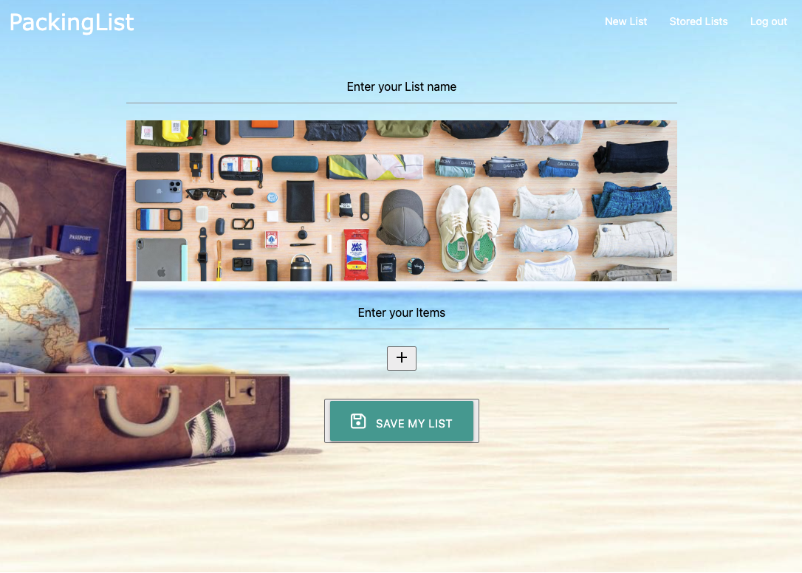

# Packing_list_travel_planner
A program to help you plan your upcoming trip by creating a packing list.

## Description

A packing list creator. 

Motivation for this program:
-Effortless Planning: Our program streamlines the packing process, making it easy for travelers to plan their trips without the stress of forgetting essential items.
-Efficient Task Management: Stay organized with a comprehensive list that guides you through the packing process. 
-Reusable Packing Lists: Benefit from the convenience of saved lists from your previous trips. Easily access and reuse packing lists, allowing you to replicate successful packing strategies.

Through this program, we learned how to create a full stack program following the MVC model (Models, Views, and Controllers), create get and post api routes, use handlebars, use mySQL, and work with databases

## Table of Contents

- [Usage](#usage)
- [Credits](#credits)
- [License](#license)

## Usage

To use this program visit the the deployed webpage. The user will create a username and login that will create a profile for the user. They will then be able to create a packing list and save it to their profile. The program will save previous packing lists for future trips.

Deployed Heroku URL: https://shielded-earth-91970-0db761988706.herokuapp.com/

    

## Credits

This is a group project with the following creators:
- Anna Chuapetcharasopon: https://github.com/ahgeak 
- Ronald Lopez: https://github.com/510rrl
- Snow (Xueying) Li: https://github.com/snowlxy1202

## License

This project uses an MIT license.
